# 3D-models

[https://github.com/jrierab/3D-models](https://github.com/jrierab/3D-models)

**CAT**: Models 3D per a impressores 3D casolanes.

* [Caixa LM2596 amb Display](#lm2596-with-display)

* [Caixa LM2596 amb Display lateral](#lm2596-with-lateral-display)

* [Maneta nevera](#manetanevera)

**EN**: 3D models for 3D printers.

* [Case for LM2596 with Display](#lm2596-with-display)

* [Case for LM2596 with lateral Display](#lm2596-with-lateral-display)

* [Refrigerator door handle replacement](#manetanevera)

## LM2596 with lateral Display

* OpenSCAD [model](./LM2596_wLateralDisplay/LM2596_wLateralDisplay.scad) (can use Customizer to parametrize it).

")

")

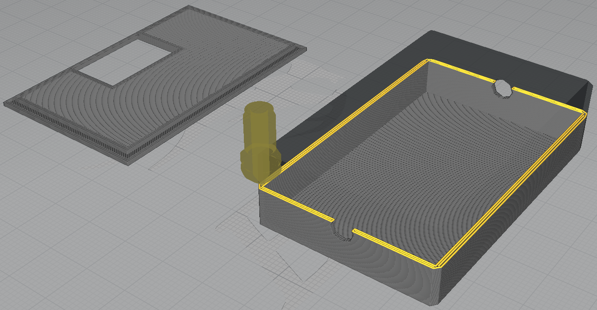

* STL [code](./LM2596_wLateralDisplay/LM2596_wLateralDisplay.stl).
* Ender-3 (Normal) [g-code](./LM2596_wLateralDisplay/CE3_LM2596_wLateralDisplay_Draft_Cubicsub.gcode). Slicer: Cura 4.1.0.
	- Print Settings : Draft - 0.2mm.
	- Infill pattern : Cubic Subdivision.
	- Infill Density : 10%.
	- Plate adhesion : None.
	- Printing Time : 1:20h aprox.

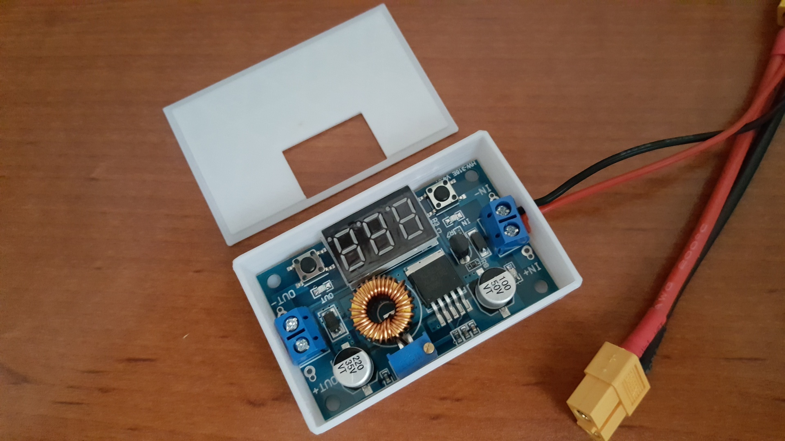

## LM2596 with Display

* OpenSCAD [model](./LM2596_wDisplay/LM2596_wDisplay.scad) (can use Customizer to parametrize it).

")

")

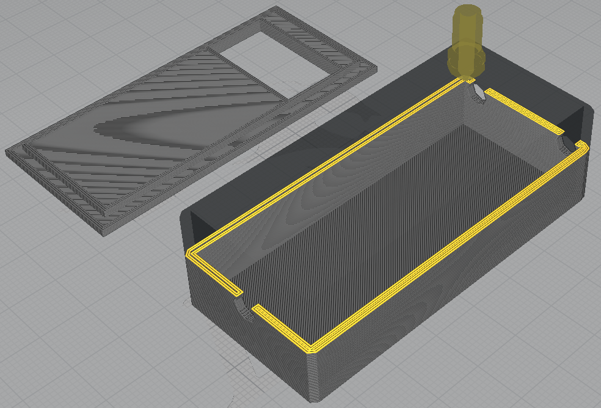

* STL [code](./LM2596_wDisplay/LM2596_wDisplay.stl).
* Ender-3 (Normal) [g-code](./LM2596_wDisplay/CE3_LM2596_wDisplay_Draft_Cubicsub.gcode). Slicer: Cura 4.1.0.
	- Print Settings : Draft - 0.2mm.
	- Infill pattern : Cubic Subdivision.
	- Infill Density : 10%.
	- Plate adhesion : None.
	- Printing Time : 1:48h aprox.

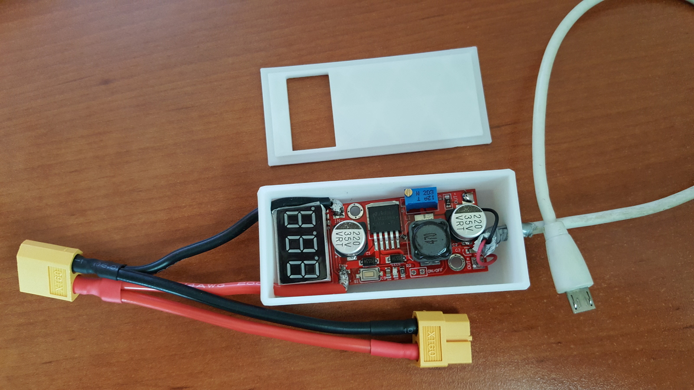

## ManetaNevera

### V2.0

* OpenSCAD [model](./ManetaNevera/ManetaNevera.scad) (can use Customizer to parametrize it).

")

")

### V1.2

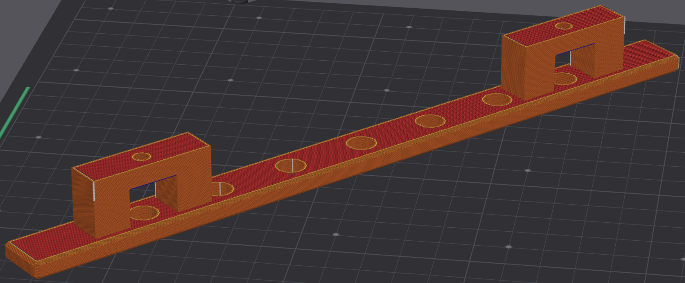

* STL [code](./ManetaNevera/ManetaNevera_V1.2.stl).
* Ender-3 V3 KE (**Strong**) version [g-code](./ManetaNevera/CE3v3KE_ManetaNevera_V1.2_PLA_1h9m.gcode). Slicer: Orca Slicer 1.9.1.
	- Infill Density : 50%.
	- Printing Time : 69m aprox.

### V1.1

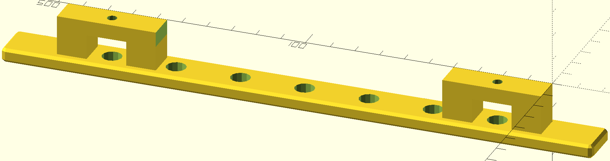

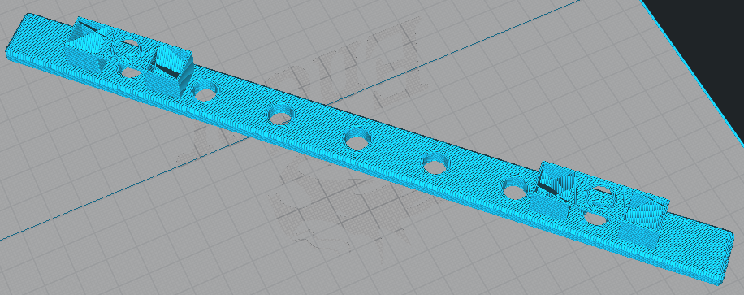

* STL [code](./ManetaNevera/ManetaNevera_V1.1.stl).
* Ender-3 (Normal) [g-code](./ManetaNevera/CE3_ManetaNevera_V1.1_Draft_Cubicsub.gcode). Slicer: Cura 4.1.0.
	- Print Settings : Draft - 0.2mm.
	- Infill pattern : Cubic Subdivision.
	- Infill Density : 10%.
	- Plate adhesion : None.
	- Printing Time : 1:40h aprox.
* Ender-3 (**Strong**) version [g-code](./ManetaNevera/CE3_ManetaNevera_V1.1_Strong.gcode). Slicer: Cura 4.1.0.
	- Print Settings : Draft - 0.2mm.
	- Infill pattern : Triangle.
	- Infill Density : 50%.
	- Connect Infill Lines : True.
	- Wall Thickness : 1.6 mm.
	- Top Thicknness : 2 mm.
	- Bottom Thickness : 1 mm.
	- Alternate Extra Wall : True.
	- Plate adhesion : None.
	- Printing Time : 3:30h aprox.

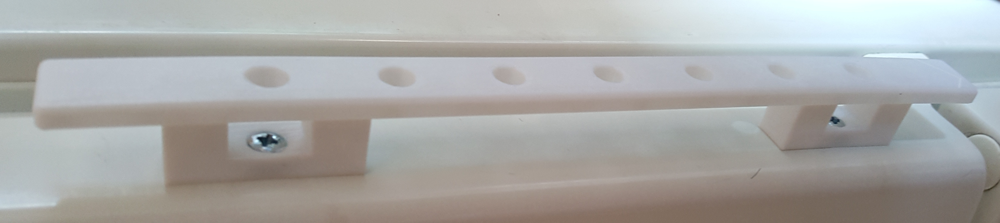
	
### V1.0

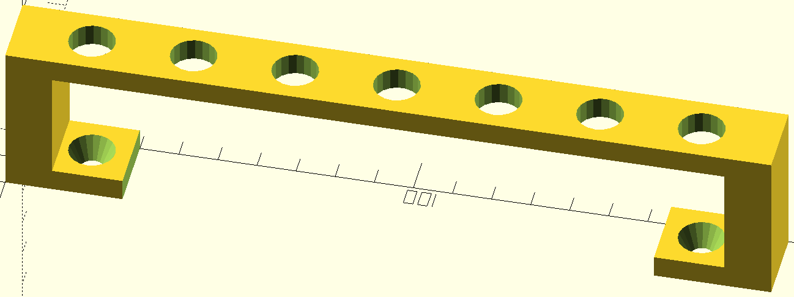

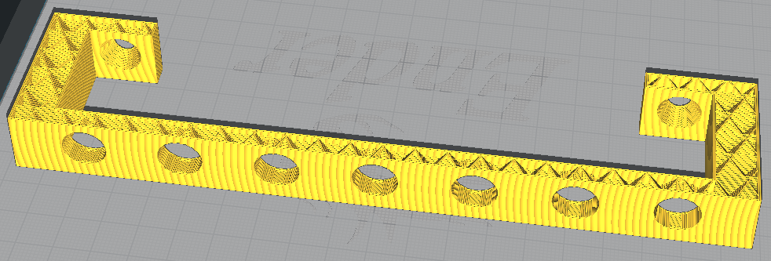

* STL [code](./ManetaNevera/ManetaNevera.stl).
* Ender-3 [g-code](./ManetaNevera/CE3_ManetaNevera_xtrFast_Cubicsub.gcode). Slicer: Cura 4.1.0.
	- Print Settings : Extra Fast - 0.3mm.
	- Infill pattern : Cubic Subdivision.
	- Infill Density : 20%.
	- Plate adhesion : None.
	- Printing Time : 1:30h aprox.
	
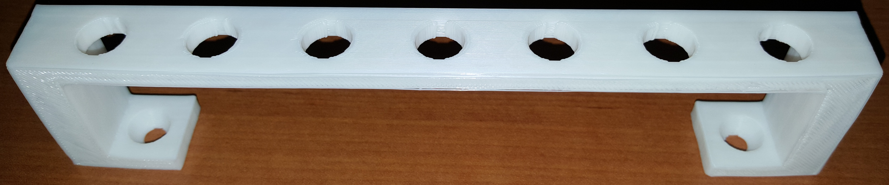
